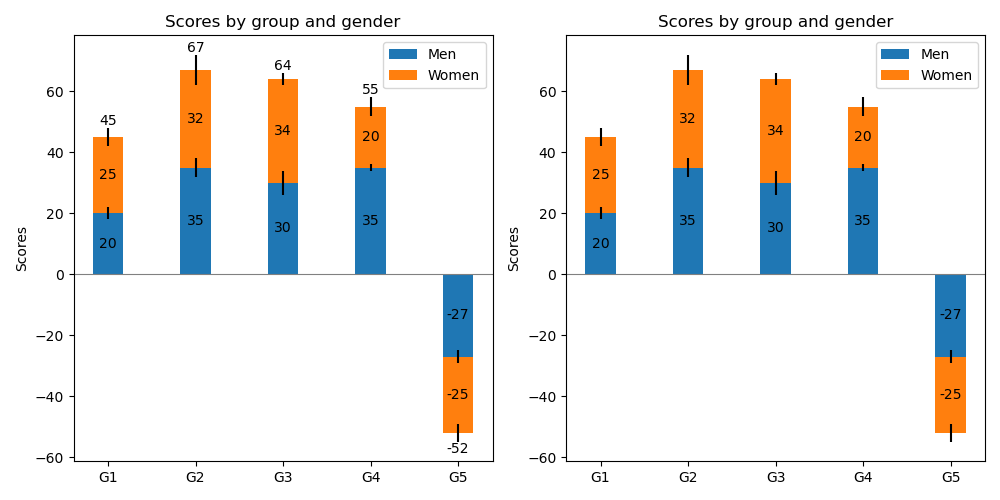
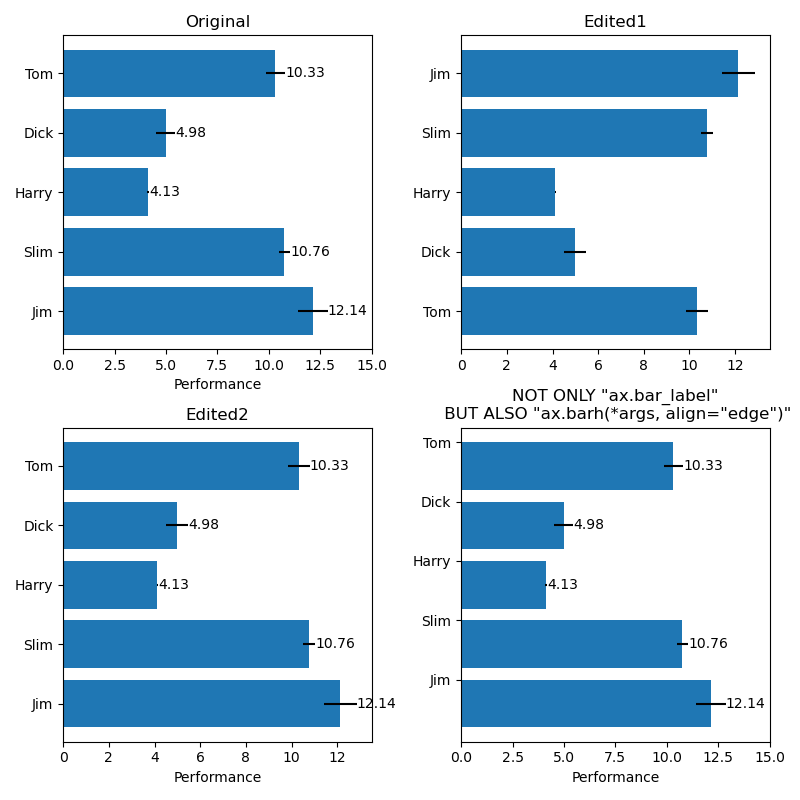

# Bar Label Demo

積み上げ棒グラフを作成するax.barについて学んだ。

## ポイント

---

plt.subplotの引数は必須ではない。

```python
plt.subplot()
```

のように、引数なしで実行すると1,1のグラフが作成される。

---

bar_labelを実行すると棒グラフ上に数値を表示できる。  
その際、積み上げ棒グラフの特定の部分の数値のみを表示したいときは

```python
ax.bar_label(bar_object, label_type='center')
```

積み上げた全体の数値を表示したいときは、

```python
ax.bar_label(bar_object, label_type='edge')
```

とする。(edgeはデフォルト値なので省略可)

---

横向き棒グラフを利用するときはy軸の値の小さい方からリストが並べられるため、  
直感的にわかりやすい「上から下にリストが並ぶ」ということにならない。  
この対応として、

```python
ax.invert_yaxis()
```

を使う。

---

## Picture

<p align="center">
  
</p>

<p align="center">
  
</p>
