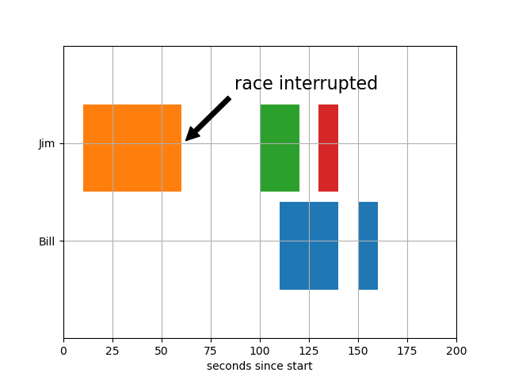

# Broken Barh

途中が途切れた棒グラフを描くための関数。  
スケジュール表を可視化するのによいかも。

## ポイント

---

ax.broken_barhは、第一、第二引数がそれぞれx軸、y軸の設定。  
開始点と幅を指定するという書式。

---

図中に注釈をいれるための機能として、ax.annotateという関数がある。
設定はそれなりにやりやすそうではあるが、引数が多いこと、
手動で場所をきめなければならないことから使い勝手はよくないかも。

---

## Picture

  

## URL
