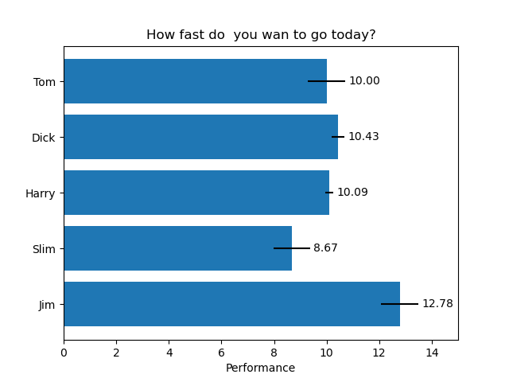

# Horizontal bar chart

横向き棒グラフを作成するサンプル。

## ポイント

---

棒グラフの書式を指定するfmtパラメータは、pythonのフォーマット文の書式ではだめ。  
CかMATLABかの書式に準拠しているのか？

---

## Picture

  

## URL

[https://matplotlib.org/stable/gallery/lines_bars_and_markers/barh.html](https://matplotlib.org/stable/gallery/lines_bars_and_markers/barh.html)