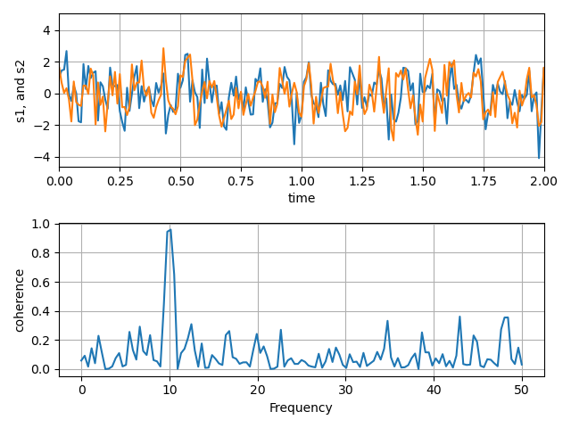

# Plotting the coherence of two signals

matplotlibのcoherenceを描画する機能

## ポイント

---

ax.cohere()で2つの関数のコヒーレンスを計算・描画することができる。  
素人考えでは、データの生成はnumpyで、描画はmatplotlibでやった方がいいと思うのだがそういうものではないのだろうか？

---

## Picture

  

## URL
